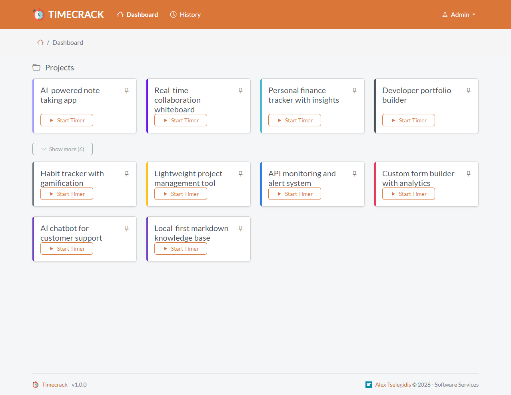

<h1 align="center">
    <br>
    <a href="https://github.com/alextselegidis/timecrack">
        
    </a>
    <br>
    Timecrack
    <br>
</h1>

<br>

<h4 align="center">
    An online time tracking application that can be installed on your server.
</h4>

<p align="center">
  
  
  
</p>

<p align="center">
  <a href="#about">About</a> •
  <a href="#features">Features</a> •
  <a href="#setup">Setup</a> •
  <a href="#installation">Installation</a> •
  <a href="#license">License</a>
</p>



## About

**Timecrack** is a time tracking application, designed for simplicity and efficiency. It lets you define your projects and tasks, and then track the time you spend on them. You can also add notes to your time entries, and view reports of your time usage.

With Timecrack you can increase your  productivity. It is a self-hosted application, so you can run it on your own server and have full control over your data.

## Features

The application allows you to manage and organize your time trackings.

- Clean & minimal interface
- Tagging & search
- Self-hosted (Docker support)
- Multi-user capable (future/planned)
- No tracking / no ads

## Setup

To clone and run this application, you'll need Docker installed on your computer. From your command line:

```bash
# Clone this repository
$ git clone https://github.com/alextselegidis/timecrack.git

# Go into the repository
$ cd timecrack

# Install dependencies
$ docker compose up -d
```

Then you can SSH into the PHP-FPM container and install the dependencies with `composer install`.

Note: the current setup works with Windows and WSL & Docker.

You can build the files by running `bash build.sh`. This command will bundle everything to a `build.zip` archive.

## Installation

You will need to perform the following steps to install the application on your server:

* Make sure that your server has Apache/Nginx, PHP (8.2+) and MySQL installed.
* Create a new database (or use an existing one).
* Copy the "timecrack" source folder on your server.
* Make sure that the "storage" directory is writable.
* Rename the ".env.example" file to ".env" and update its contents based on your environment.
* Run the `php artisan migrate:fresh` command from the terminal.
* Open the browser on the Timecrack URL and log in with admin@example.org and 12345678 as the password.

That's it! You can now use Timecrack at your will.

## Demo data

A dedicated `DemoSeeder` is shipped to populate the database with a realistic
demo dataset (one manager, three IT developers, eight software projects and
one month of past time-tracking entries). It is **not** wired into
`DatabaseSeeder.php` and therefore never runs during a normal `db:seed` —
you have to invoke it explicitly:

```bash
php artisan db:seed --class=DemoSeeder
```

### "Migrate with seed"

When you read references to *"migrate with seed"* in Laravel docs or in
this project, it refers to running the database migrations and then
immediately invoking the registered seeders in a single command:

```bash
# Run any pending migrations and then run DatabaseSeeder
php artisan migrate --seed

# Drop all tables, re-run every migration from scratch and then seed
php artisan migrate:fresh --seed
```

Both commands only execute the seeders that are wired into
`DatabaseSeeder::run()`. Because `DemoSeeder` is intentionally **not**
registered there, neither `migrate --seed` nor `migrate:fresh --seed` will
populate the demo dataset — that still has to be triggered explicitly with
the `--class=DemoSeeder` invocation shown above (and can be combined with
a fresh migration if you want a clean slate):

```bash
php artisan migrate:fresh && php artisan db:seed --class=DemoSeeder
```

The seeder is idempotent: running it again refreshes the trackings of the
demo team without duplicating users or projects. All demo accounts use
`12345678` as the password and emails of the form `<firstname>@example.org`
(e.g. `sarah@example.org`, `david@example.org`, `priya@example.org`,
`lukas@example.org`).

You will find the latest release at [github.com/alextselegidis/timecrack](https://github.com/alextselegidis/timecrack).
You can also report problems on the [issues page](https://github.com/alextselegidis/timecrack/issues)
and help the development progress.

## License

Code Licensed Under [GPL v3.0](https://www.gnu.org/licenses/gpl-3.0.en.html) | Content Under [CC BY 3.0](https://creativecommons.org/licenses/by/3.0/)

---

Website [alextselegidis.com](https://alextselegidis.com) &nbsp;&middot;&nbsp;
GitHub [alextselegidis](https://github.com/alextselegidis) &nbsp;&middot;&nbsp;
Twitter [@alextselegidis](https://twitter.com/AlexTselegidis)

###### More Projects On Github
###### ⇾ [Plainpad · Self Hosted Note Taking App](https://github.com/alextselegidis/plainpad)
###### ⇾ [Easy!Appointments · Online Appointment Scheduler](https://github.com/alextselegidis/easyappointments)
###### ⇾ [Integravy · Service Orchestration At Your Fingertips](https://github.com/alextselegidis/integravy)
